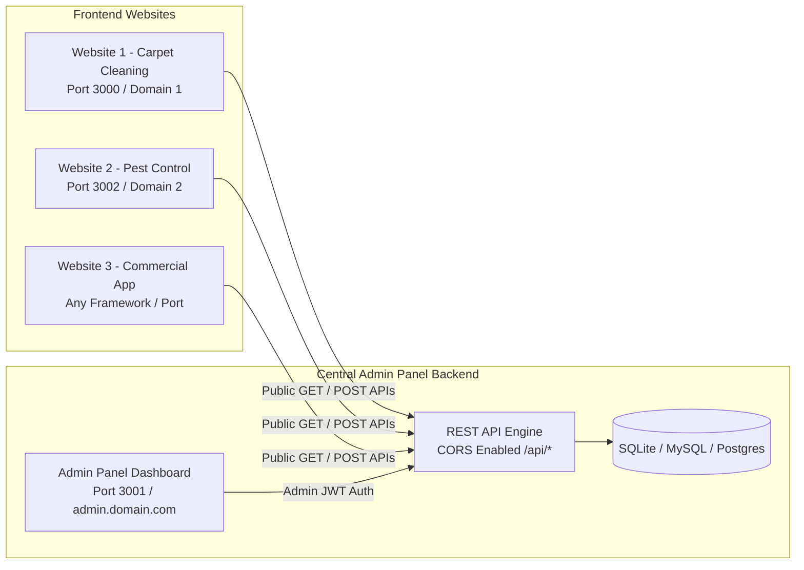

# 🌐 Centralized Admin Panel & Headless API Documentation

This Admin Panel is completely decoupled and can serve as a **centralized headless CMS & operations backend** for **any external website** (Next.js, React, Vue, PHP, WordPress, HTML/JS, or Mobile Apps).

---

## 🏗️ Architecture Overview



---

## 🚀 How to Run Admin Panel Standalone

### Method 1: Export to a Separate Project Folder
Run the automated exporter script from this project:
- **Windows Batch**: Double-click `export-admin.bat`
- **PowerShell**:
  ```powershell
  .\export-admin.ps1 -TargetDir "..\admin-panel"
  ```

Then start the standalone Admin App:
```bash
cd ..\admin-panel
npm install
npx prisma db push
npm run dev
```
Your standalone admin dashboard is live at **`http://localhost:3001/admin`**.

---

## 📡 Public REST API Endpoints (For External Websites)

All public endpoints have **CORS enabled** (`Access-Control-Allow-Origin: *`) so you can call them from any domain or localhost port.

### Base URL:
- Local Development: `http://localhost:3001` (or `http://localhost:3000`)
- Production: `https://your-admin-domain.com`

---

### 1. Services API
Fetch active services, descriptions, pricing, tab features, and images.

- **Get all active services:**
  ```http
  GET /api/services
  ```
- **Get single service by slug:**
  ```http
  GET /api/services?slug=bond-cleaning-brisbane
  ```
- **Sample JSON Response:**
  ```json
  {
    "success": true,
    "data": [
      {
        "id": "cm...",
        "name": "Bond Cleaning Brisbane",
        "slug": "bond-cleaning-brisbane",
        "shortDesc": "100% Bond Back Guarantee cleaning service.",
        "priceStarting": 199,
        "priceUnit": "Fixed",
        "heroImage": "/assets/services/bond.jpg",
        "features": ["100% Bond Guarantee", "Free Re-clean in 72h"]
      }
    ]
  }
  ```

---

### 2. Blog Posts API
Fetch published articles for your website blog.

- **Get all published blogs:**
  ```http
  GET /api/blogs
  ```
- **Get single blog article:**
  ```http
  GET /api/blogs?slug=how-to-deep-clean-carpet
  ```

---

### 3. FAQs API
Fetch FAQs for service pages or dedicated FAQ sections.

- **Get all FAQs:**
  ```http
  GET /api/faqs
  ```

---

### 4. Testimonials & Reviews API
Fetch verified customer reviews.

- **Get approved testimonials:**
  ```http
  GET /api/testimonials
  ```

---

### 5. Site Settings API
Fetch dynamic company phone numbers, email, addresses, header/footer settings, and SEO configurations.

- **Get all settings:**
  ```http
  GET /api/settings
  ```

---

### 6. Submit Contact / Enquiry (Lead Capture)
Post customer inquiry forms directly to your admin inbox & email notification system.

- **Endpoint:**
  ```http
  POST /api/contact
  Content-Type: application/json
  ```
- **Request Body:**
  ```json
  {
    "firstName": "John",
    "lastName": "Doe",
    "email": "john@example.com",
    "phone": "0412345678",
    "service": "Bond Cleaning",
    "bedrooms": "3",
    "bathrooms": "2",
    "message": "Need cleaning for upcoming lease end on Friday."
  }
  ```
- **Response:**
  ```json
  {
    "success": true,
    "message": "Enquiry submitted successfully",
    "enquiryNumber": "ENQ-2026-0001"
  }
  ```

---

### 7. Submit Online Booking
Create real-time bookings from external checkout or estimate calculators.

- **Endpoint:**
  ```http
  POST /api/bookings
  Content-Type: application/json
  ```
- **Request Body:**
  ```json
  {
    "customerName": "Jane Smith",
    "customerEmail": "jane@example.com",
    "customerPhone": "0498765432",
    "serviceName": "End of Lease Cleaning",
    "serviceAddress": "123 Queen Street, Brisbane QLD 4000",
    "scheduledDate": "2026-10-15T09:00:00Z",
    "timeSlot": "Morning",
    "rooms": 3,
    "bathrooms": 2,
    "totalPrice": 350,
    "notes": "Key under the front mat."
  }
  ```

---

## 💻 Integration Examples

### 🔹 Example A: Next.js / React (Client or Server Component)

```tsx
// Example: Fetch services inside any Next.js or React website
const ADMIN_API = process.env.NEXT_PUBLIC_ADMIN_API || "http://localhost:3001";

export async function getServices() {
  const res = await fetch(`${ADMIN_API}/api/services`, {
    next: { revalidate: 60 }, // Cache & revalidate every 60 seconds
  });
  const data = await res.json();
  return data.success ? data.data : [];
}

// Example: Submit Contact Form
export async function submitContactForm(formData) {
  const res = await fetch(`${ADMIN_API}/api/contact`, {
    method: "POST",
    headers: { "Content-Type": "application/json" },
    body: JSON.stringify(formData),
  });
  return res.json();
}
```

---

### 🔹 Example B: Plain HTML / JavaScript (Any Website)

```html
<form id="leadForm">
  <input type="text" id="name" placeholder="Your Name" required />
  <input type="email" id="email" placeholder="Your Email" required />
  <input type="tel" id="phone" placeholder="Phone Number" required />
  <textarea id="message" placeholder="Your Message"></textarea>
  <button type="submit">Submit Request</button>
</form>

<script>
  document.getElementById("leadForm").addEventListener("submit", async (e) => {
    e.preventDefault();
    const payload = {
      firstName: document.getElementById("name").value,
      email: document.getElementById("email").value,
      phone: document.getElementById("phone").value,
      message: document.getElementById("message").value,
    };

    const res = await fetch("http://localhost:3001/api/contact", {
      method: "POST",
      headers: { "Content-Type": "application/json" },
      body: JSON.stringify(payload),
    });

    const result = await res.json();
    if (result.success) {
      alert("Thank you! Your enquiry has been received.");
    }
  });
</script>
```

---

### 🔹 Example C: PHP / WordPress Integration

```php
<?php
// Fetch Services from Admin Backend in PHP
$admin_url = "http://localhost:3001/api/services";
$response = file_get_contents($admin_url);
$services = json_decode($response, true)['data'] ?? [];

foreach ($services as $service) {
    echo "<h3>" . htmlspecialchars($service['name']) . "</h3>";
    echo "<p>" . htmlspecialchars($service['shortDesc']) . "</p>";
}
?>
```

---

## 🔒 Admin API Authentication (JWT Bearer Token)

If an external mobile app or privileged system needs to manage data directly, authenticate via:

1. **Login Endpoint**:
   ```http
   POST /api/auth/login
   Content-Type: application/json

   {
     "email": "admin@brisbane.com",
     "password": "YourSecurePassword"
   }
   ```
2. **Use Token in Header**:
   ```http
   GET /api/admin/bookings
   Authorization: Bearer <token_received_from_login>
   ```
